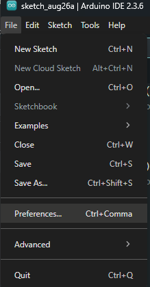
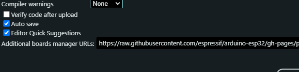
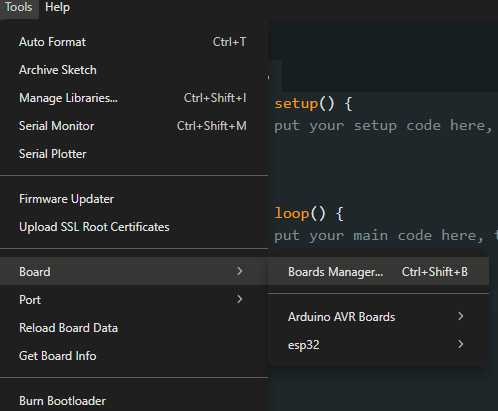
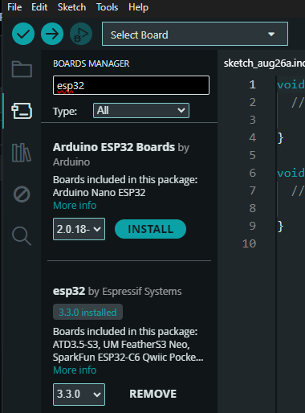
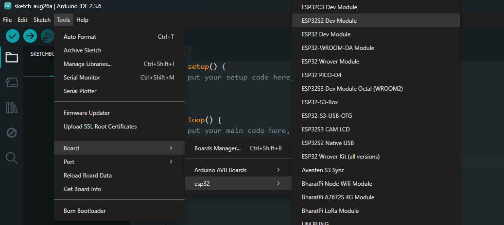
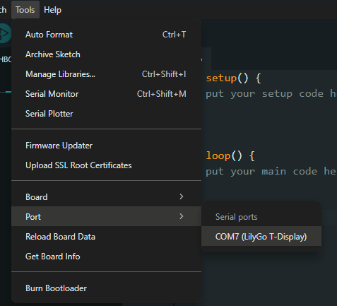

# Configuração da ESP32 no Arduino IDE 2.x

# 1. Instalar o Arduino IDE

Baixe e instale a versão mais recente do Arduino IDE 2.x pelo site oficial

[Download Arduino IDE](https://docs.arduino.cc/software/ide-v2/tutorials/getting-started/ide-v2-downloading-and-installing/)

# 2. Adicionar URL de suporte à ESP32
1. No menu superior, vá em File → Preferences
2. Na seção Additional Boards Manager URLs, adicione o link

`https://raw.githubusercontent.com/espressif/arduino-esp32/gh-pages/package_esp32_index.json
`

## Passo 1

## Passo 2

Certifique-se de deixar marcada a opção Editor Quick Suggestions.

# Instalar as placas ESP32

1. Vá em Tools → Board → Board Manager...
2. Pesquise por esp32 e instale o pacote da Espressif Systems.
## Passo 1

## Passo2

E após conectar a ESP32 no computador

# Selecionar a placa correta

1. Vá em Tools → Board → esp32
2. Escolha ESP32 Dev Module (recomendado para ESP32-WROOM-32 DevKit V1).

# Selecionar a porta

1. Vá em Tools → Port
2. Selecione a porta onde a ESP32 foi reconhecida (ex: COM7).
3. Pode não ser o mesmo para o seu computador

